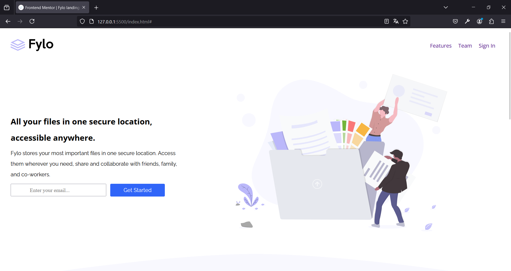

# Frontend Mentor - Fylo landing page with two column layout solution

This is a solution to the [Fylo landing page with two column layout challenge on Frontend Mentor](https://www.frontendmentor.io/challenges/fylo-landing-page-with-two-column-layout-5ca5ef041e82137ec91a50f5). Frontend Mentor challenges help you improve your coding skills by building realistic projects. 

## Table of contents

- [Overview](#overview)
  - [The challenge](#the-challenge)
  - [Screenshot](#screenshot)
  - [Links](#links)
- [My process](#my-process)
  - [Built with](#built-with)
  - [What I learned](#what-i-learned)
  - [Continued development](#continued-development)
  - [Useful resources](#useful-resources)
- [Author](#author)

## Overview

### The challenge

Users should be able to:

- View the optimal layout for the site depending on their device's screen size
- See hover states for all interactive elements on the page

### Screenshot



### Links

- Solution URL: [Add solution URL here](https://your-solution-url.com)
- Live Site URL: [https://fylolandingweb-albertovama.netlify.app]

## My process

### Built with

- Semantic HTML5 markup
- CSS custom properties
- Flexbox
- CSS Grid

### What I learned

Use this section to recap over some of your major learnings while working through this project. Writing these out and providing code samples of areas you want to highlight is a great way to reinforce your own knowledge.

To see how you can add code snippets, see below:

```html
<h1>Some HTML code I'm proud of</h1>
<footer class="footer">
      

      <div class="links-icons">
        <div class="contact">
          <p>Phone: +1-543-123-4567</p>
          <p>example@fylo.com</p>
        </div>
        <div class="links">
          <a href="#">About Us</a>
          <a href="#">Jobs</a>
          <a href="#">Press</a>
          <a href="#">Blog</a>
        </div>
        <div class="links">
          <a href="#">Contact Us</a>
          <a href="#">Terms</a>
          <a href="#">Privacy</a>
        </div>
        <div class="social-media">
          <a href="#"></a>
          <a href="#"></a>
          <a href="#"></a>
        </div>
      </div>
    </footer>
```
```css
.proud-of-this-css {
  blockquote {
    margin-top: 2rem;
}

blockquote::before{
    content: '';
    display: block;
    background-image: url(../images/icon-quotes.svg);
    background-repeat: no-repeat;
    width: 5rem;
    height: 8rem;
    position: absolute;
    top: 147%;
}
}
```
```js
const proudOfThisFunc = () => {
  console.log('🎉')
}
```

### Continued development

Im keeping focusing the footer and header stuff because the organization is hard to do it.

### Useful resources

- [CSSMatic](https://www.cssmatic.com/es/box-shadow) - This helped me to create box shadows.

## Author

- Frontend Mentor - [@AlbertoVaMa](https://www.frontendmentor.io/profile/AlbertoVaMa)
- Twitter - [@Betungas18](https://x.com/Betungas18)


